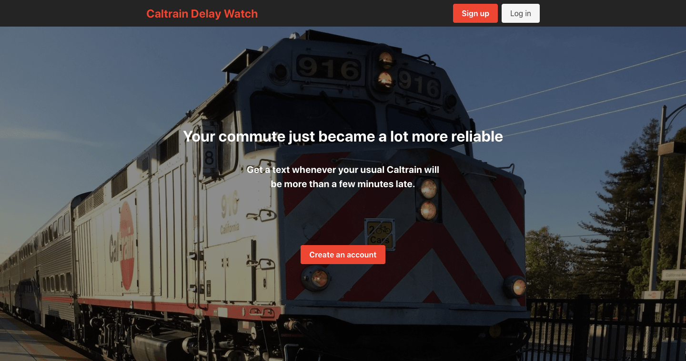

<h1 align="center">
   | Caltrain Delay Watch
</h1>

<h3 align="center" style="font-weight: bold">
  <a href="https://caltrain-delay-watch.web.app/" style="text-decoration: none">Live Site</a>
</h3>

  

\
Caltrain Delay Watch is a full-stack web app (React/Node.js) that allows users to monitor their daily commute and receive a text message whenever their usual Caltrain is running more than a few minutes late.

The frontend is a progressive web app with a mobile-first design. The backend pings [511 SF Bay's Open Transit Data API](https://511.org/open-data/transit) every 5 minutes looking for delays in users' monitored trains and sends them a text message via Twilio as soon as a train is reported 10 minutes or more late.

Most days, most users won't get any notifications. But when they do, it can be a huge time- and frustration-saver.

## Technologies

### Core: MERN Stack

  * [MongoDB Atlas](https://www.mongodb.com/cloud/atlas)
  * [Express](https://expressjs.com/)
  * [React/JavaScript](https://reactjs.org/)
  * [Node.js](https://nodejs.org/)

### API / Database / Security

  * [Axios](https://github.com/axios/axios)
  * [Mongoose](https://mongoosejs.com/)
  * [Passport](http://www.passportjs.org/)
  * [JSONWebToken](https://www.npmjs.com/package/jsonwebtoken)

### Notifications

  * [Twilio](https://www.twilio.com/)

### Hosting

  * [Frontend - Firebase](https://firebase.google.com/)
  * [Backend - Heroku](https://heroku.com/)

### User Interface

  * [Bulma](https://bulma.io/)
  * [Styled Components](https://styled-components.com/)

### Testing

  * [Cypress](https://www.cypress.io/)

### Misc. Features

  * [Node Schedule](https://www.npmjs.com/package/node-schedule)
  * [Formik](https://jaredpalmer.com/formik/)
  * [Yup](https://github.com/jquense/yup)
  * [Moment.js](https://momentjs.com/)

## Questions?

Feel free to contact Mike at mldunham@gmail.com or visit https://www.mikedunham.org.